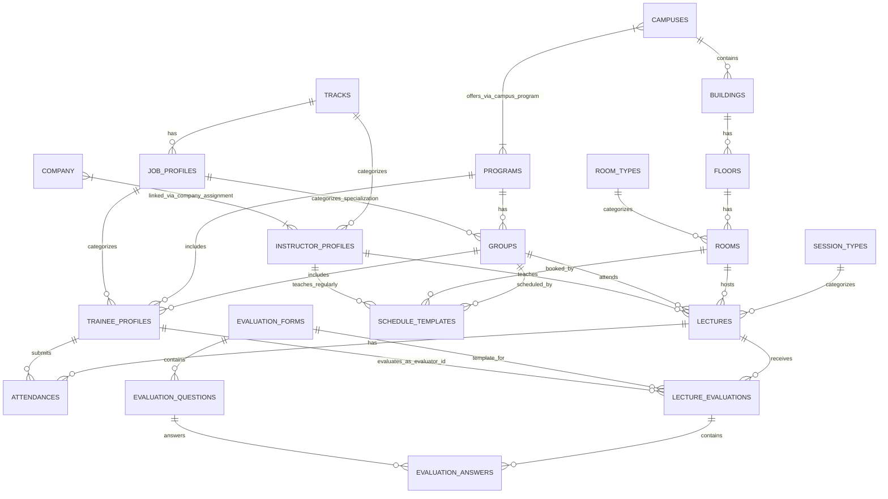

# المرجع الدقيق الشامل لهيكلية قاعدة البيانات (Education Schema)

بناءً على طلبك، هذا هو المرجع التحليلي المعمق لكل جدول وكل حقل داخل هيكلية التعليم (`education schema`). تم استخراج تمامی القيود الثابتة (`ENUMs/Check Clauses`) وتوضيح دلالاتها بالكامل، بالإضافة إلى رسم بياني لهيكل العلاقات (ERD) في نهاية المستند.

---

## 🏛️ المحور الأول: المنشآت والبنية التحتية (Facilities)

### 1. [campuses](/app/Modules/Educational/Domain/Models/Program.php#18-27) (الفروع / المقار)
قائمة مقرات المركز الرئيسية.
- `id` (bigint): المعرف الفريد.
- `name` (varchar): اسم الفرع.
- `code` (varchar): كود الفرع المختصر.
- `address` (varchar): عنوان الفرع جغرافياً.
- `status` (varchar): حالة الفرع. **القيم الثابتة:**
  - `active`: يعمل ومتاح.
  - `inactive`: غير متاح أو مغلق.

### 2. `buildings` (المباني)
المباني التابعة لكل فرع.
- `campus_id` (bigint): يتبع لأي فرع.
- `name` (varchar): اسم المبنى.
- `code` (varchar): كود المبنى.
- `status` (varchar): **القيم الثابتة:** (`active` / `inactive`).

### 3. `floors` (الأدوار / الطوابق)
- `building_id` (bigint): يتبع لأي مبنى.
- `floor_number` (varchar): رقم أو كود الدور.
- `name` (varchar): اسم الدلع للدور إن وجد.
- `status` (varchar): **القيم الثابتة:** (`active` / `inactive`).

### 4. `room_types` (أنواع القاعات)
- `name` (varchar): اسم النوع (مثل: معمل حاسب).
- `slug` (varchar): الاسم البرمجي.
- `color` (varchar): اللون المميز في واجهة المستخدم (مثل: `primary`).
- `icon` (varchar): الأيقونة في الواجهة (مثل: `ri-door-open-line`).
- `is_active` (boolean): مفعل (true) أم لا (false).

### 5. `rooms` (القاعات والمعامل)
- `floor_id` (bigint): في أي دور تقع.
- `room_type_id` (bigint): مرجع لنوع القاعة من `room_types`.
- `name` (varchar): اسم القاعة (مثل: قاعة عزوز).
- `capacity` (integer): السعة القصوى لعدد المتدربين.
- `room_type` (varchar): *حقل قديم/رديف يحدد نوع القاعة بالنص*. **القيم:**
  - [lecture](/app/Modules/Educational/Domain/Models/Group.php#34-38): قاعة محاضرات عادية.
  - `lab`: معمل تطبيقي.
  - `hall`: مدرج كبير.
  - `meeting`: غرفة اجتماعات.
- `room_status` (varchar): جاهزية القاعة. **القيم:**
  - `active`: متاحة للاستخدام.
  - `maintenance`: تحت الصيانة (لا يمكن الحجز فيها).
  - `disabled`: معطلة تماماً أو خارج الخدمة.

---

## 📚 المحور الثاني: الهيكل الأكاديمي (Academic Structure)

### 1. `programs` (البرامج التدريبية)
يمثل دورة زمنية كاملة أو دبلومة.
- `name` (varchar): اسم البرنامج.
- `description` (text): الوصف التعريفي للبرنامج.
- `starts_at` / `ends_at` (date): تاريخ بدء وانتهاء البرنامج المنطقي.
- `status` (varchar): حالة البرنامج الأكاديمية. **القيم:**
  - `draft`: مسودة، قيد التجهيز ولم يعلن.
  - `published`: معلن ويمكن التسجيل فيه.
  - `running`: البرنامج شغال حالياً والطلاب يدرسون.
  - `completed`: انتهت فترة البرنامج بنجاح.
  - `archived`: مؤرشف ولا يظهر في القوائم النشطة.

### 2. [groups](/app/Modules/Educational/Domain/Models/Program.php#33-37) (المجموعات / الفصول)
الفصول الدراسية داخل كل برنامج.
- `program_id` (bigint): تتبع لأي برنامج.
- `job_profile_id` (bigint): تخصص هذه المجموعة.
- `name` (varchar): اسم المجموعة.
- `capacity` (integer): السعة القصوى (الافتراضي 20).
- `term` (varchar): الفصل الدراسي المعنية به.
- `status` (varchar): حالة المجموعة (مثل `active`).
- `cancellation_reason` (text): سبب إلغاء المجموعة في حال تم دمجها.
- `transferred_to_group_id` (bigint): إذا تم دمج أو نقل طلاب هذه المجموعة لمجموعة أخرى.

### 3. `tracks` (المسارات الكبرى)
تخصصات رئيسية (مثلاً: شبكات، تطوير برمجيات).
- `name`, `slug`, `code` (varchar): مسميات ورموز المسار.
- `is_active` (boolean): مفعل أم لا.

### 4. `job_profiles` (التخصصات الفرعية الوظيفية)
- `track_id` (bigint): ينتمي لأي مسار رئيسي.
- `name`, `code` (varchar): المسمى والكود.
- `status` (varchar): (`active` / `inactive`).

### 5. `session_types` (أنواع الجلسات)
أنواع المحاضرات المنعقدة (مثال: نظري، عملي، امتحان).
- `name` (varchar): اسم نوع الجلسة.
- `description` (text): الشرح.
- `is_active` (boolean).

---

## 👥 المحور الثالث: المستخدمين والملفات وملحقاتهم (Profiles)

### 1. `trainee_profiles` (ملفات المتدربين)
- `user_id` (bigint): ربط مع جدول المستخدمين الرئيسي للولوج للنظام.
- `program_id` / `group_id`: مكان الطالب الأكاديمي الحالي.
- `national_id`, `passport_number`, `nationality` (varchar): وثائق الهوية والجنسية (الافتراضي `egyptian`).
- `arabic_name`, `english_name`: الأسماء الصريحة للطالب.
- `date_of_birth` (date): تاريخ الميلاد.
- `gender` (varchar): الجنس. **القيم:** (`male` / `female`).
- `educational_status` (varchar): مرحلته الأكاديمية. **القيم:**
  - `student`: طالب حالي.
  - `graduate`: خريج أكمل دراسته.
- `enrollment_status` (varchar): حالة التسجيل. **القيم:**
  - `active`: منتظم بالدراسة ومقيد.
  - `on_leave`: في إجازة معتمدة.
  - `graduated`: متخرج.
  - `withdrawn`: منسحب.
  - `suspended`: موقوف (عقوبة أو مشاكل إدارية).

### 2. `trainee_emergency_contacts` (جهات اتصال طوارئ للمتدرب)
- `trainee_profile_id`: ملف المتدرب صاحب جهة الاتصال.
- `relation` (varchar): صلة القرابة.
- `name`, `phone`, `national_id`: بيانات قريب التواصل.

### 3. `instructor_profiles` (ملفات المدربين)
- `user_id` / `track_id` / `governorate_id`.
- `bio` (text): سيرة ذاتية.
- `gender` (varchar): (`male` / `female`).
- `employment_type` (varchar): نوع التعاقد. **القيم:**
  - `full_time`: موظف بدوام كامل.
  - `part_time`: موظف بدوام جزئي.
  - `contractor`: تعاقد خارجي (حر/بالساعة).
- `status` (varchar): حالة المدرب. **القيم:**
  - `active`: يعمل بانتظام.
  - `inactive`: غير يعمل مؤقتاً.
  - `suspended`: إيقاف عن العمل.

### 4. `training_companies` (شركات التدريب)
- `name`, `registration_number`, `website`, `contact_email`: تفاصيل الشركة.
- `status` (varchar): حالة الشراكة (`active`, `inactive`, `suspended`).

---

## 🗓️ المحور الرابع: التشغيل والمحاضرات (Operations)

### 1. `schedule_templates` (قوالب الجدول الأسبوعي)
- `program_id`, `group_id`, `instructor_profile_id`, `room_id`: الموارد الثابتة.
- `day_of_week` (integer): من 0 (الأحد) إلى 6 (السبت) لتمثيل اليوم.
- `start_time` / `end_time` (time): أوقات الساعة (مثال `09:00:00`).
- `recurrence_type` (varchar): نوع التكرار للمحاضرات التي سيتم توليدها تلقائيا.
- `effective_from` / `effective_until`: تاريخ بداية ونهاية صلاحية هذا القالب الزمني للعمل.

### 2. [lectures](/app/Modules/Educational/Domain/Models/Group.php#34-38) (المحاضرات الفعلية في الجدول الزمني)
- `program_id`, `group_id`, `instructor_profile_id`, `room_id`, `supervisor_id`: الأشخاص والجهات والمكان.
- `starts_at` / `ends_at` (timestamp): وقت بداية ونهاية المحاضرة الدقيق باليوم والساعة.
- `status` (varchar): حالة سير المحاضرة. **القيم:**
  - `scheduled`: مجدولة (دورها لم يأتِ بعد).
  - `running`: قيد الانعقاد والتشغيل الآن.
  - `completed`: تامة ومنتهية.
  - `cancelled`: ملغاة لأي ظرف.
  - `rescheduled`: تم إعادة جدولتها لوقت آخر.

### 3. [attendances](/app/Modules/Educational/Domain/Models/Lecture.php#62-66) (سجل الحضور والغياب)
- `lecture_id`: المحاضرة المعينة.
- `trainee_profile_id`: المتدرب.
- `check_in_time` (time): ساعة التبصيم.
- `locked_at` (timestamp): دلالة على إقفال المحاضرة بحيث لا يتم التراجع عن الغياب من قبل موظف لتقفيل العهدة.
- `status` (varchar): حالة الحضور. **القيم:**
  - `present`: حاضر (منتظم).
  - `absent`: غائب.
  - [late](/app/Modules/Educational/Domain/Models/Lecture.php#52-56): متأخر عن الدوام.
  - `excused`: غائب بعذر مقبول.

---

## ⭐ المحور الخامس: التقييمات والجودة (Evaluations)

### 1. `evaluation_forms` (نماذج التقييم الهياكلية)
- `title`: اسم النموذج.
- `type` (varchar): غرض النموذج. **القيم:**
  - `lecture_feedback`: تقييم المحاضرة ذاتها.
  - `course_evaluation`: تقييم منهج الكورس الكلي.
  - `instructor_evaluation`: تقييم المدرب شخصياً.
  - `general`: عام لاستخدامات أخرى.
- `status` (varchar): (`draft`, `published`, `archived`).

### 2. `evaluation_questions` (أسئلة النماذج)
- `form_id`: تابع لأي نموذج تقييم.
- `question_text`: نص السؤال (مثال: "ما رأيك في طريقة الشرح؟").
- `type` (varchar): نوع إجابة السؤال. **القيم:**
  - `rating_1_to_5`: تقييم بالنجوم من 1 لـ 5.
  - `text`: نص حر.
  - `boolean`: (نعم / لا).
  - `multiple_choice`: اختيارات متعددة تُحفظ في الـ JSON.
- `options` (json): يحفظ الخيارات لو كان السؤال `multiple_choice`.

### 3. `lecture_evaluations` (التقييمات المسلمة من المتدربين)
- `lecture_id`: للمحاضرة التي تم تقييمها.
- `form_id`: النموذج الذي تم استخدامه.
- `evaluator_role` (varchar): وظيفة الشخص الذي قام بالتقييم. **القيم:**
  - [trainee](/app/Modules/Educational/Domain/Models/Group.php#44-48): طالب حضر المحاضرة.
  - `observer`: مراقب جودة.
  - `admin`: إداري بالمركز.
- `evaluator_id`: معرف الشخص (بالـ ID).
- `overall_comments` (text): التعليق العام المفتوح.
- `form_snapshot` (jsonb): توثيق كامل لشكل النموذج أثناء التقييم لو تم تغيير الأسئلة في المستقبل.

### 4. `evaluation_answers` (الإجابات والتنقيط)
- `lecture_evaluation_id`: تتبع للورقة المسلمة الأساسية.
- `question_id`: السؤال المحدد.
- `answer_value` (text): الإجابة النصية.
- `answer_rating` (integer): التقييم الرقمي للأسئلة المعتمدة على الدرجات الرقمية.

---

## 🗺️ مخطط الكيانات والعلاقات (ERD)

هذا الرسم البياني التوضيحي باستخدام كود (Mermaid) يربط الكيانات الرئيسية ببعضها مع دلالات العلاقات (1-to-Many و Many-to-Many).

