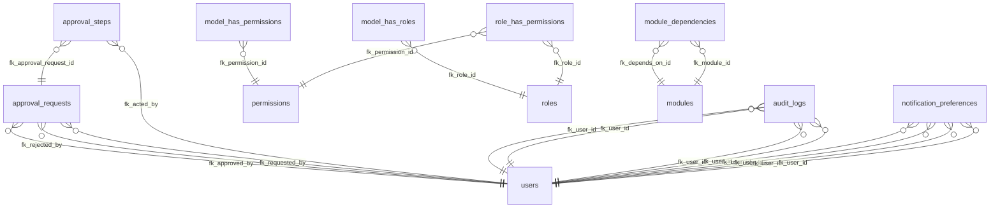

# Public System Database Architecture & Technical Documentation
# الوثيقة الفنية والبنية المعمارية لقاعدة البيانات التأسيسية للموقع (Public Schema)

This document provides a comprehensive, professional, and structured technical documentation for all 29 tables in the `public` schema.

## 1. Table: `approval_requests`

### Columns / الحقول
| Column (الحقل) | Type (النوع) | Nullable | Default | FK | Enum/Check | Description (الوصف) |
|---|---|---|---|---|---|---|
| `id` | `bigint` | NO | `nextval('approval_requests_id_seq'::regclass)` | No | No | Unique Identifier / المعرف الفريد |
| `approvable_schema` | `character varying(255)` | YES | `` | No | No | - |
| `approvable_type` | `character varying(255)` | NO | `` | No | No | - |
| `approvable_id` | `bigint` | NO | `` | No | No | - |
| `action` | `character varying(255)` | NO | `'other'::character varying` | No | No | - |
| `status` | `character varying(255)` | NO | `'pending'::character varying` | No | No | - |
| `requested_by` | `bigint` | NO | `` | Yes (users) | No | Reference to users / مرجع لجدول users |
| `approved_by` | `bigint` | YES | `` | Yes (users) | No | Reference to users / مرجع لجدول users |
| `rejected_by` | `bigint` | YES | `` | Yes (users) | No | Reference to users / مرجع لجدول users |
| `approval_level` | `integer` | NO | `1` | No | No | - |
| `metadata` | `json` | YES | `` | No | No | - |
| `expires_at` | `timestamp without time zone` | YES | `` | No | No | - |
| `created_at` | `timestamp without time zone` | YES | `` | No | No | Creation time / وقت الإنشاء |
| `updated_at` | `timestamp without time zone` | YES | `` | No | No | Last update / آخر تحديث |

---

## 2. Table: `approval_steps`

### Columns / الحقول
| Column (الحقل) | Type (النوع) | Nullable | Default | FK | Enum/Check | Description (الوصف) |
|---|---|---|---|---|---|---|
| `id` | `bigint` | NO | `nextval('approval_steps_id_seq'::regclass)` | No | No | Unique Identifier / المعرف الفريد |
| `approval_request_id` | `bigint` | NO | `` | Yes (approval_requests) | No | Reference to approval_requests / مرجع لجدول approval_requests |
| `step_level` | `integer` | NO | `` | No | No | - |
| `required_permission` | `character varying(255)` | YES | `` | No | No | - |
| `status` | `character varying(255)` | NO | `'pending'::character varying` | No | No | - |
| `acted_by` | `bigint` | YES | `` | Yes (users) | No | Reference to users / مرجع لجدول users |
| `comments` | `text` | YES | `` | No | No | - |
| `acted_at` | `timestamp without time zone` | YES | `` | No | No | - |
| `created_at` | `timestamp without time zone` | YES | `` | No | No | Creation time / وقت الإنشاء |
| `updated_at` | `timestamp without time zone` | YES | `` | No | No | Last update / آخر تحديث |

---

## 3. Table: `audit_logs`

### Columns / الحقول
| Column (الحقل) | Type (النوع) | Nullable | Default | FK | Enum/Check | Description (الوصف) |
|---|---|---|---|---|---|---|
| `id` | `bigint` | NO | `nextval('audit_logs_id_seq'::regclass)` | No | No | Unique Identifier / المعرف الفريد |
| `user_id` | `bigint` | YES | `` | Yes (users) | No | Reference to users / مرجع لجدول users |
| `event` | `character varying(255)` | NO | `` | No | No | - |
| `auditable_type` | `character varying(255)` | YES | `` | No | No | - |
| `auditable_id` | `bigint` | YES | `` | No | No | - |
| `old_values` | `json` | YES | `` | No | No | - |
| `new_values` | `json` | YES | `` | No | No | - |
| `category` | `character varying(255)` | YES | `` | No | No | - |
| `log_level` | `character varying(255)` | NO | `'info'::character varying` | No | No | - |
| `url` | `text` | YES | `` | No | No | - |
| `ip_address` | `character varying(45)` | YES | `` | No | No | - |
| `user_agent` | `text` | YES | `` | No | No | - |
| `created_at` | `timestamp without time zone` | YES | `CURRENT_TIMESTAMP` | No | No | Creation time / وقت الإنشاء |

---

## 4. Table: `cache`

### Columns / الحقول
| Column (الحقل) | Type (النوع) | Nullable | Default | FK | Enum/Check | Description (الوصف) |
|---|---|---|---|---|---|---|
| `key` | `character varying(255)` | NO | `` | No | No | - |
| `value` | `text` | NO | `` | No | No | - |
| `expiration` | `integer` | NO | `` | No | No | - |

---

## 5. Table: `cache_locks`

### Columns / الحقول
| Column (الحقل) | Type (النوع) | Nullable | Default | FK | Enum/Check | Description (الوصف) |
|---|---|---|---|---|---|---|
| `key` | `character varying(255)` | NO | `` | No | No | - |
| `owner` | `character varying(255)` | NO | `` | No | No | - |
| `expiration` | `integer` | NO | `` | No | No | - |

---

## 6. Table: `chaos_reports`

### Columns / الحقول
| Column (الحقل) | Type (النوع) | Nullable | Default | FK | Enum/Check | Description (الوصف) |
|---|---|---|---|---|---|---|
| `id` | `bigint` | NO | `nextval('chaos_reports_id_seq'::regclass)` | No | No | Unique Identifier / المعرف الفريد |
| `test_name` | `character varying(255)` | NO | `` | No | No | Name / الاسم |
| `type` | `character varying(255)` | NO | `` | No | No | - |
| `result` | `character varying(255)` | NO | `` | No | No | - |
| `metrics` | `json` | YES | `` | No | No | - |
| `summary` | `text` | YES | `` | No | No | - |
| `started_at` | `timestamp without time zone` | NO | `` | No | No | - |
| `completed_at` | `timestamp without time zone` | YES | `` | No | No | - |
| `created_at` | `timestamp without time zone` | YES | `` | No | No | Creation time / وقت الإنشاء |
| `updated_at` | `timestamp without time zone` | YES | `` | No | No | Last update / آخر تحديث |

---

## 7. Table: `job_batches`

### Columns / الحقول
| Column (الحقل) | Type (النوع) | Nullable | Default | FK | Enum/Check | Description (الوصف) |
|---|---|---|---|---|---|---|
| `id` | `character varying(255)` | NO | `` | No | No | Unique Identifier / المعرف الفريد |
| `name` | `character varying(255)` | NO | `` | No | No | Name / الاسم |
| `total_jobs` | `integer` | NO | `` | No | No | - |
| `pending_jobs` | `integer` | NO | `` | No | No | - |
| `failed_jobs` | `integer` | NO | `` | No | No | - |
| `failed_job_ids` | `text` | NO | `` | No | No | - |
| `options` | `text` | YES | `` | No | No | - |
| `cancelled_at` | `integer` | YES | `` | No | No | - |
| `created_at` | `integer` | NO | `` | No | No | Creation time / وقت الإنشاء |
| `finished_at` | `integer` | YES | `` | No | No | - |

---

## 8. Table: `jobs`

### Columns / الحقول
| Column (الحقل) | Type (النوع) | Nullable | Default | FK | Enum/Check | Description (الوصف) |
|---|---|---|---|---|---|---|
| `id` | `bigint` | NO | `nextval('jobs_id_seq'::regclass)` | No | No | Unique Identifier / المعرف الفريد |
| `queue` | `character varying(255)` | NO | `` | No | No | - |
| `payload` | `text` | NO | `` | No | No | - |
| `attempts` | `smallint` | NO | `` | No | No | - |
| `reserved_at` | `integer` | YES | `` | No | No | - |
| `available_at` | `integer` | NO | `` | No | No | - |
| `created_at` | `integer` | NO | `` | No | No | Creation time / وقت الإنشاء |

---

## 9. Table: `legacy_data_conflicts`

### Columns / الحقول
| Column (الحقل) | Type (النوع) | Nullable | Default | FK | Enum/Check | Description (الوصف) |
|---|---|---|---|---|---|---|
| `id` | `bigint` | NO | `nextval('legacy_data_conflicts_id_seq'::regclass)` | No | No | Unique Identifier / المعرف الفريد |
| `source_table` | `character varying(255)` | NO | `` | No | No | - |
| `legacy_id` | `bigint` | NO | `` | No | No | - |
| `conflict_type` | `character varying(255)` | NO | `` | No | No | - |
| `duplicate_key` | `character varying(255)` | NO | `` | No | No | - |
| `payload_json` | `json` | YES | `` | No | No | - |
| `resolution_status` | `character varying(255)` | NO | `'pending'::character varying` | No | No | - |
| `created_at` | `timestamp without time zone` | YES | `` | No | No | Creation time / وقت الإنشاء |
| `updated_at` | `timestamp without time zone` | YES | `` | No | No | Last update / آخر تحديث |

---

## 10. Table: `migration_id_map`

### Columns / الحقول
| Column (الحقل) | Type (النوع) | Nullable | Default | FK | Enum/Check | Description (الوصف) |
|---|---|---|---|---|---|---|
| `id` | `bigint` | NO | `nextval('migration_id_map_id_seq'::regclass)` | No | No | Unique Identifier / المعرف الفريد |
| `table_name` | `character varying(255)` | NO | `` | No | No | Name / الاسم |
| `old_id` | `bigint` | NO | `` | No | No | - |
| `new_id` | `bigint` | NO | `` | No | No | - |
| `created_at` | `timestamp without time zone` | YES | `` | No | No | Creation time / وقت الإنشاء |
| `updated_at` | `timestamp without time zone` | YES | `` | No | No | Last update / آخر تحديث |

---

## 11. Table: `model_has_permissions`

### Columns / الحقول
| Column (الحقل) | Type (النوع) | Nullable | Default | FK | Enum/Check | Description (الوصف) |
|---|---|---|---|---|---|---|
| `permission_id` | `bigint` | NO | `` | Yes (permissions) | No | Reference to permissions / مرجع لجدول permissions |
| `model_type` | `character varying(255)` | NO | `` | No | No | - |
| `model_id` | `bigint` | NO | `` | No | No | - |

---

## 12. Table: `model_has_roles`

### Columns / الحقول
| Column (الحقل) | Type (النوع) | Nullable | Default | FK | Enum/Check | Description (الوصف) |
|---|---|---|---|---|---|---|
| `role_id` | `bigint` | NO | `` | Yes (roles) | No | Reference to roles / مرجع لجدول roles |
| `model_type` | `character varying(255)` | NO | `` | No | No | - |
| `model_id` | `bigint` | NO | `` | No | No | - |

---

## 13. Table: `module_dependencies`

### Columns / الحقول
| Column (الحقل) | Type (النوع) | Nullable | Default | FK | Enum/Check | Description (الوصف) |
|---|---|---|---|---|---|---|
| `id` | `bigint` | NO | `nextval('module_dependencies_id_seq'::regclass)` | No | No | Unique Identifier / المعرف الفريد |
| `module_id` | `uuid` | NO | `` | Yes (modules) | No | Reference to modules / مرجع لجدول modules |
| `depends_on_id` | `uuid` | NO | `` | Yes (modules) | No | Reference to modules / مرجع لجدول modules |

---

## 14. Table: `module_request_traces`

### Columns / الحقول
| Column (الحقل) | Type (النوع) | Nullable | Default | FK | Enum/Check | Description (الوصف) |
|---|---|---|---|---|---|---|
| `id` | `bigint` | NO | `nextval('module_request_traces_id_seq'::regclass)` | No | No | Unique Identifier / المعرف الفريد |
| `request_id` | `uuid` | NO | `` | No | No | - |
| `module_slug` | `character varying(255)` | NO | `` | No | No | - |
| `module_state` | `character varying(255)` | NO | `` | No | No | - |
| `latency_ms` | `integer` | NO | `` | No | No | - |
| `http_method` | `character varying(255)` | NO | `` | No | No | - |
| `url` | `text` | NO | `` | No | No | - |
| `status_code` | `integer` | NO | `` | No | No | - |
| `user_id` | `bigint` | YES | `` | No | No | - |
| `ip_address` | `character varying(255)` | YES | `` | No | No | - |
| `created_at` | `timestamp without time zone` | YES | `` | No | No | Creation time / وقت الإنشاء |
| `updated_at` | `timestamp without time zone` | YES | `` | No | No | Last update / آخر تحديث |

---

## 15. Table: `modules`

### Columns / الحقول
| Column (الحقل) | Type (النوع) | Nullable | Default | FK | Enum/Check | Description (الوصف) |
|---|---|---|---|---|---|---|
| `id` | `uuid` | NO | `` | No | No | Unique Identifier / المعرف الفريد |
| `slug` | `character varying(255)` | NO | `` | No | No | - |
| `name` | `character varying(255)` | NO | `` | No | No | Name / الاسم |
| `version` | `character varying(255)` | YES | `` | No | No | - |
| `status` | `character varying(255)` | NO | `'registered'::character varying` | No | No | - |
| `is_core` | `boolean` | NO | `false` | No | No | - |
| `priority` | `integer` | NO | `0` | No | No | - |
| `feature_flags` | `json` | YES | `` | No | No | - |
| `metadata` | `json` | YES | `` | No | No | - |
| `health_status` | `character varying(255)` | NO | `'healthy'::character varying` | No | No | - |
| `max_concurrent_requests` | `integer` | NO | `20` | No | No | - |
| `state_version` | `bigint` | NO | `'1'::bigint` | No | No | - |
| `created_at` | `timestamp without time zone` | YES | `` | No | No | Creation time / وقت الإنشاء |
| `updated_at` | `timestamp without time zone` | YES | `` | No | No | Last update / آخر تحديث |
| `total_requests` | `bigint` | NO | `'0'::bigint` | No | No | - |
| `total_latency_ms` | `bigint` | NO | `'0'::bigint` | No | No | - |
| `uptime_seconds` | `bigint` | NO | `'0'::bigint` | No | No | - |
| `last_status_change_at` | `timestamp without time zone` | NO | `CURRENT_TIMESTAMP` | No | No | - |
| `degradation_count` | `integer` | NO | `0` | No | No | - |
| `sla_target` | `numeric` | NO | `99.9` | No | No | - |

---

## 16. Table: `notification_event_types`

### Columns / الحقول
| Column (الحقل) | Type (النوع) | Nullable | Default | FK | Enum/Check | Description (الوصف) |
|---|---|---|---|---|---|---|
| `id` | `bigint` | NO | `nextval('notification_event_types_id_seq'::regclass)` | No | No | Unique Identifier / المعرف الفريد |
| `key` | `character varying(255)` | NO | `` | No | No | - |
| `title` | `character varying(255)` | NO | `` | No | No | - |
| `description` | `character varying(255)` | YES | `` | No | No | - |
| `category` | `character varying(255)` | NO | `'system'::character varying` | No | No | - |
| `is_mandatory` | `boolean` | NO | `false` | No | No | - |
| `available_channels` | `json` | NO | `` | No | No | - |
| `created_at` | `timestamp without time zone` | YES | `` | No | No | Creation time / وقت الإنشاء |
| `updated_at` | `timestamp without time zone` | YES | `` | No | No | Last update / آخر تحديث |

---

## 17. Table: `notification_preferences`

### Columns / الحقول
| Column (الحقل) | Type (النوع) | Nullable | Default | FK | Enum/Check | Description (الوصف) |
|---|---|---|---|---|---|---|
| `id` | `bigint` | NO | `nextval('notification_preferences_id_seq'::regclass)` | No | No | Unique Identifier / المعرف الفريد |
| `user_id` | `bigint` | NO | `` | Yes (users) | No | Reference to users / مرجع لجدول users |
| `event_type` | `character varying(255)` | NO | `` | No | No | - |
| `channels` | `json` | NO | `` | No | No | - |
| `sound_enabled` | `boolean` | NO | `false` | No | No | - |
| `enabled` | `boolean` | NO | `true` | No | No | - |
| `created_at` | `timestamp without time zone` | YES | `` | No | No | Creation time / وقت الإنشاء |
| `updated_at` | `timestamp without time zone` | YES | `` | No | No | Last update / آخر تحديث |

---

## 18. Table: `notification_retry_logs`

### Columns / الحقول
| Column (الحقل) | Type (النوع) | Nullable | Default | FK | Enum/Check | Description (الوصف) |
|---|---|---|---|---|---|---|
| `id` | `bigint` | NO | `nextval('notification_retry_logs_id_seq'::regclass)` | No | No | Unique Identifier / المعرف الفريد |
| `notification_id` | `uuid` | NO | `` | No | No | - |
| `notifiable_type` | `character varying(255)` | NO | `` | No | No | - |
| `notifiable_id` | `bigint` | NO | `` | No | No | - |
| `channel` | `character varying(255)` | NO | `` | No | No | - |
| `error_message` | `text` | YES | `` | No | No | - |
| `payload` | `json` | YES | `` | No | No | - |
| `resolved` | `boolean` | NO | `false` | No | No | - |
| `created_at` | `timestamp without time zone` | YES | `` | No | No | Creation time / وقت الإنشاء |
| `updated_at` | `timestamp without time zone` | YES | `` | No | No | Last update / آخر تحديث |

---

## 19. Table: `notification_thresholds`

### Columns / الحقول
| Column (الحقل) | Type (النوع) | Nullable | Default | FK | Enum/Check | Description (الوصف) |
|---|---|---|---|---|---|---|
| `id` | `bigint` | NO | `nextval('notification_thresholds_id_seq'::regclass)` | No | No | Unique Identifier / المعرف الفريد |
| `event_type` | `character varying(255)` | NO | `` | No | No | - |
| `max_count` | `integer` | NO | `5` | No | No | - |
| `time_window` | `integer` | NO | `3600` | No | No | - |
| `severity` | `character varying(255)` | NO | `'warning'::character varying` | No | No | - |
| `enabled` | `boolean` | NO | `true` | No | No | - |
| `description` | `text` | YES | `` | No | No | - |
| `created_at` | `timestamp without time zone` | YES | `` | No | No | Creation time / وقت الإنشاء |
| `updated_at` | `timestamp without time zone` | YES | `` | No | No | Last update / آخر تحديث |

---

## 20. Table: `notifications`

### Columns / الحقول
| Column (الحقل) | Type (النوع) | Nullable | Default | FK | Enum/Check | Description (الوصف) |
|---|---|---|---|---|---|---|
| `id` | `uuid` | NO | `` | No | No | Unique Identifier / المعرف الفريد |
| `type` | `character varying(255)` | NO | `` | No | No | - |
| `notifiable_type` | `character varying(255)` | NO | `` | No | No | - |
| `notifiable_id` | `bigint` | NO | `` | No | No | - |
| `data` | `json` | NO | `` | No | No | - |
| `read_at` | `timestamp without time zone` | YES | `` | No | No | - |
| `created_at` | `timestamp without time zone` | NO | `` | No | No | Creation time / وقت الإنشاء |
| `expires_at` | `timestamp without time zone` | YES | `` | No | No | - |
| `updated_at` | `timestamp without time zone` | YES | `` | No | No | Last update / آخر تحديث |

---

## 21. Table: `notifications_archive`

### Columns / الحقول
| Column (الحقل) | Type (النوع) | Nullable | Default | FK | Enum/Check | Description (الوصف) |
|---|---|---|---|---|---|---|
| `id` | `uuid` | NO | `` | No | No | Unique Identifier / المعرف الفريد |
| `type` | `character varying(255)` | NO | `` | No | No | - |
| `notifiable_type` | `character varying(255)` | NO | `` | No | No | - |
| `notifiable_id` | `bigint` | NO | `` | No | No | - |
| `data` | `json` | NO | `` | No | No | - |
| `read_at` | `timestamp without time zone` | YES | `` | No | No | - |
| `created_at` | `timestamp without time zone` | NO | `` | No | No | Creation time / وقت الإنشاء |
| `archived_at` | `timestamp without time zone` | NO | `CURRENT_TIMESTAMP` | No | No | - |

---

## 22. Table: `password_reset_tokens`

### Columns / الحقول
| Column (الحقل) | Type (النوع) | Nullable | Default | FK | Enum/Check | Description (الوصف) |
|---|---|---|---|---|---|---|
| `email` | `character varying(255)` | NO | `` | No | No | - |
| `token` | `character varying(255)` | NO | `` | No | No | - |
| `created_at` | `timestamp without time zone` | YES | `` | No | No | Creation time / وقت الإنشاء |

---

## 23. Table: `permissions`

### Columns / الحقول
| Column (الحقل) | Type (النوع) | Nullable | Default | FK | Enum/Check | Description (الوصف) |
|---|---|---|---|---|---|---|
| `id` | `bigint` | NO | `nextval('permissions_id_seq'::regclass)` | No | No | Unique Identifier / المعرف الفريد |
| `name` | `character varying(255)` | NO | `` | No | No | Name / الاسم |
| `guard_name` | `character varying(255)` | NO | `` | No | No | Name / الاسم |
| `created_at` | `timestamp without time zone` | YES | `` | No | No | Creation time / وقت الإنشاء |
| `updated_at` | `timestamp without time zone` | YES | `` | No | No | Last update / آخر تحديث |
| `module` | `character varying(255)` | NO | `'Core'::character varying` | No | No | - |

---

## 24. Table: `role_has_permissions`

### Columns / الحقول
| Column (الحقل) | Type (النوع) | Nullable | Default | FK | Enum/Check | Description (الوصف) |
|---|---|---|---|---|---|---|
| `permission_id` | `bigint` | NO | `` | Yes (permissions) | No | Reference to permissions / مرجع لجدول permissions |
| `role_id` | `bigint` | NO | `` | Yes (roles) | No | Reference to roles / مرجع لجدول roles |

---

## 25. Table: `roles`

### Columns / الحقول
| Column (الحقل) | Type (النوع) | Nullable | Default | FK | Enum/Check | Description (الوصف) |
|---|---|---|---|---|---|---|
| `id` | `bigint` | NO | `nextval('roles_id_seq'::regclass)` | No | No | Unique Identifier / المعرف الفريد |
| `name` | `character varying(255)` | NO | `` | No | No | Name / الاسم |
| `guard_name` | `character varying(255)` | NO | `` | No | No | Name / الاسم |
| `created_at` | `timestamp without time zone` | YES | `` | No | No | Creation time / وقت الإنشاء |
| `updated_at` | `timestamp without time zone` | YES | `` | No | No | Last update / آخر تحديث |
| `display_name` | `character varying(255)` | YES | `` | No | No | Name / الاسم |
| `description` | `text` | YES | `` | No | No | - |

---

## 26. Table: `sessions`

### Columns / الحقول
| Column (الحقل) | Type (النوع) | Nullable | Default | FK | Enum/Check | Description (الوصف) |
|---|---|---|---|---|---|---|
| `id` | `character varying(255)` | NO | `` | No | No | Unique Identifier / المعرف الفريد |
| `user_id` | `bigint` | YES | `` | No | No | - |
| `ip_address` | `character varying(45)` | YES | `` | No | No | - |
| `user_agent` | `text` | YES | `` | No | No | - |
| `payload` | `text` | NO | `` | No | No | - |
| `last_activity` | `integer` | NO | `` | No | No | - |

---

## 27. Table: `settings`

### Columns / الحقول
| Column (الحقل) | Type (النوع) | Nullable | Default | FK | Enum/Check | Description (الوصف) |
|---|---|---|---|---|---|---|
| `id` | `bigint` | NO | `nextval('settings_id_seq'::regclass)` | No | No | Unique Identifier / المعرف الفريد |
| `key` | `character varying(255)` | NO | `` | No | No | - |
| `value` | `text` | YES | `` | No | No | - |
| `group` | `character varying(255)` | NO | `'general'::character varying` | No | No | - |
| `type` | `character varying(255)` | NO | `'string'::character varying` | No | No | - |
| `label` | `character varying(255)` | YES | `` | No | No | - |
| `description` | `text` | YES | `` | No | No | - |
| `is_public` | `boolean` | NO | `false` | No | No | - |
| `created_at` | `timestamp without time zone` | YES | `` | No | No | Creation time / وقت الإنشاء |
| `updated_at` | `timestamp without time zone` | YES | `` | No | No | Last update / آخر تحديث |
| `sort_order` | `integer` | NO | `0` | No | No | - |

---

## 28. Table: `system_settings`

### Columns / الحقول
| Column (الحقل) | Type (النوع) | Nullable | Default | FK | Enum/Check | Description (الوصف) |
|---|---|---|---|---|---|---|
| `id` | `bigint` | NO | `nextval('system_settings_id_seq'::regclass)` | No | No | Unique Identifier / المعرف الفريد |
| `name` | `character varying(255)` | NO | `` | No | No | Name / الاسم |
| `value` | `jsonb` | YES | `` | No | No | - |
| `module` | `character varying(255)` | NO | `'Core'::character varying` | No | No | - |
| `type` | `character varying(255)` | NO | `'string'::character varying` | No | No | - |
| `is_encrypted` | `boolean` | NO | `false` | No | No | - |
| `created_at` | `timestamp without time zone` | YES | `` | No | No | Creation time / وقت الإنشاء |
| `updated_at` | `timestamp without time zone` | YES | `` | No | No | Last update / آخر تحديث |

---

## 29. Table: `users`

### Columns / الحقول
| Column (الحقل) | Type (النوع) | Nullable | Default | FK | Enum/Check | Description (الوصف) |
|---|---|---|---|---|---|---|
| `id` | `bigint` | NO | `nextval('users_id_seq'::regclass)` | No | No | Unique Identifier / المعرف الفريد |
| `first_name` | `character varying(255)` | NO | `` | No | No | Name / الاسم |
| `last_name` | `character varying(255)` | NO | `` | No | No | Name / الاسم |
| `username` | `character varying(255)` | NO | `` | No | No | Name / الاسم |
| `email` | `character varying(255)` | NO | `` | No | No | - |
| `email_verified_at` | `timestamp without time zone` | YES | `` | No | No | - |
| `password` | `character varying(255)` | NO | `` | No | No | - |
| `avatar` | `character varying(255)` | YES | `` | No | No | - |
| `phone` | `character varying(255)` | YES | `` | No | No | - |
| `language` | `character varying(255)` | NO | `'ar'::character varying` | No | No | - |
| `theme_mode` | `character varying(255)` | NO | `'dark'::character varying` | No | No | - |
| `timezone` | `character varying(255)` | NO | `'UTC'::character varying` | No | No | - |
| `status` | `character varying(255)` | NO | `'active'::character varying` | No | No | - |
| `status_reason` | `text` | YES | `` | No | No | - |
| `joined_at` | `timestamp without time zone` | NO | `CURRENT_TIMESTAMP` | No | No | - |
| `activated_at` | `timestamp without time zone` | YES | `` | No | No | - |
| `blocked_at` | `timestamp without time zone` | YES | `` | No | No | - |
| `last_login_at` | `timestamp without time zone` | YES | `` | No | No | - |
| `two_factor_secret` | `text` | YES | `` | No | No | - |
| `two_factor_recovery_codes` | `text` | YES | `` | No | No | - |
| `two_factor_confirmed_at` | `timestamp without time zone` | YES | `` | No | No | - |
| `two_factor_enabled` | `boolean` | NO | `false` | No | No | - |
| `remember_token` | `character varying(100)` | YES | `` | No | No | - |
| `created_at` | `timestamp without time zone` | YES | `` | No | No | Creation time / وقت الإنشاء |
| `updated_at` | `timestamp without time zone` | YES | `` | No | No | Last update / آخر تحديث |
| `unread_notifications_count` | `integer` | NO | `0` | No | No | - |
| `profile_completion_score` | `integer` | NO | `0` | No | No | - |
| `security_risk_level` | `character varying(255)` | NO | `'medium'::character varying` | No | No | - |
| `scheduled_for_deletion_at` | `timestamp without time zone` | YES | `` | No | No | - |
| `legacy_id` | `bigint` | YES | `` | No | No | - |

---

## Entity Relationship Diagram (ERD)

## 6. Security & Scalability (الأمان والتوسع)
- **Security / الأمان:** Strict foreign key constraints prevent orphan records. Users table is the core of authentication. Roles and permissions validate authorization.
- **Scalability / التوسع:** Ensure indexes on polymorphic relationships like `model_has_permissions`.
