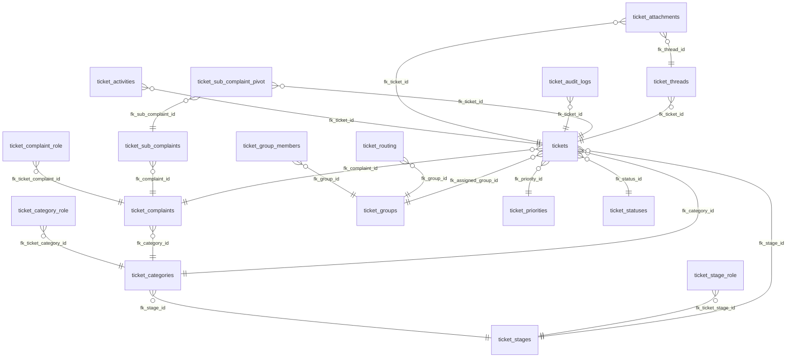

# Ticketing System Database Architecture & Technical Documentation
# الوثيقة الفنية والبنية المعمارية لقاعدة بيانات نظام التذاكر

This document provides a comprehensive, professional, and structured technical documentation for all 19 tables in the `tickets` schema.

## 1. Table: `ticket_activities`

### Columns / الحقول
| Column (الحقل) | Type (النوع) | Nullable | Default | FK | Enum/Check | Description (الوصف) |
|---|---|---|---|---|---|---|
| `id` | `bigint` | NO | `nextval('tickets.ticket_activities_id_seq'::regclass)` | No | No | Unique Identifier / المعرف الفريد |
| `ticket_id` | `bigint` | NO | `` | Yes (tickets) | No | Reference to tickets / مرجع لجدول tickets |
| `user_id` | `bigint` | YES | `` | No | No | - |
| `activity_type` | `character varying(255)` | NO | `` | No | No | - |
| `description` | `text` | NO | `` | No | No | - |
| `properties` | `jsonb` | YES | `` | No | No | - |
| `created_at` | `timestamp without time zone` | YES | `` | No | No | Creation time / وقت الإنشاء |
| `updated_at` | `timestamp without time zone` | YES | `` | No | No | Last update / آخر تحديث |
| `legacy_id` | `bigint` | YES | `` | No | No | - |

---

## 2. Table: `ticket_attachments`

### Columns / الحقول
| Column (الحقل) | Type (النوع) | Nullable | Default | FK | Enum/Check | Description (الوصف) |
|---|---|---|---|---|---|---|
| `id` | `bigint` | NO | `nextval('tickets.ticket_attachments_id_seq'::regclass)` | No | No | Unique Identifier / المعرف الفريد |
| `ticket_id` | `bigint` | NO | `` | Yes (tickets) | No | Reference to tickets / مرجع لجدول tickets |
| `thread_id` | `bigint` | YES | `` | Yes (ticket_threads) | No | Reference to ticket_threads / مرجع لجدول ticket_threads |
| `file_path` | `character varying(255)` | NO | `` | No | No | - |
| `file_name` | `character varying(255)` | NO | `` | No | No | Name / الاسم |
| `mime_type` | `character varying(255)` | YES | `` | No | No | - |
| `file_size` | `integer` | YES | `` | No | No | - |
| `created_at` | `timestamp without time zone` | YES | `` | No | No | Creation time / وقت الإنشاء |
| `updated_at` | `timestamp without time zone` | YES | `` | No | No | Last update / آخر تحديث |

---

## 3. Table: `ticket_audit_logs`

### Columns / الحقول
| Column (الحقل) | Type (النوع) | Nullable | Default | FK | Enum/Check | Description (الوصف) |
|---|---|---|---|---|---|---|
| `id` | `bigint` | NO | `nextval('tickets.ticket_audit_logs_id_seq'::regclass)` | No | No | Unique Identifier / المعرف الفريد |
| `ticket_id` | `bigint` | NO | `` | Yes (tickets) | No | Reference to tickets / مرجع لجدول tickets |
| `user_id` | `bigint` | NO | `` | No | No | - |
| `action` | `character varying(255)` | NO | `` | No | No | - |
| `old_value` | `text` | YES | `` | No | No | - |
| `new_value` | `text` | YES | `` | No | No | - |
| `created_at` | `timestamp without time zone` | YES | `` | No | No | Creation time / وقت الإنشاء |
| `updated_at` | `timestamp without time zone` | YES | `` | No | No | Last update / آخر تحديث |
| `legacy_id` | `bigint` | YES | `` | No | No | - |

---

## 4. Table: `ticket_categories`

### Columns / الحقول
| Column (الحقل) | Type (النوع) | Nullable | Default | FK | Enum/Check | Description (الوصف) |
|---|---|---|---|---|---|---|
| `id` | `bigint` | NO | `nextval('tickets.ticket_categories_id_seq'::regclass)` | No | No | Unique Identifier / المعرف الفريد |
| `name` | `character varying(255)` | NO | `` | No | No | Name / الاسم |
| `stage_id` | `bigint` | YES | `` | Yes (ticket_stages) | No | Reference to ticket_stages / مرجع لجدول ticket_stages |
| `sla_hours` | `integer` | YES | `` | No | No | - |
| `created_at` | `timestamp without time zone` | YES | `` | No | No | Creation time / وقت الإنشاء |
| `updated_at` | `timestamp without time zone` | YES | `` | No | No | Last update / آخر تحديث |
| `legacy_id` | `bigint` | YES | `` | No | No | - |

---

## 5. Table: `ticket_category_role`

### Columns / الحقول
| Column (الحقل) | Type (النوع) | Nullable | Default | FK | Enum/Check | Description (الوصف) |
|---|---|---|---|---|---|---|
| `id` | `bigint` | NO | `nextval('tickets.ticket_category_role_id_seq'::regclass)` | No | No | Unique Identifier / المعرف الفريد |
| `ticket_category_id` | `bigint` | NO | `` | Yes (ticket_categories) | No | Reference to ticket_categories / مرجع لجدول ticket_categories |
| `role_id` | `bigint` | NO | `` | No | No | - |
| `created_at` | `timestamp without time zone` | YES | `` | No | No | Creation time / وقت الإنشاء |
| `updated_at` | `timestamp without time zone` | YES | `` | No | No | Last update / آخر تحديث |

---

## 6. Table: `ticket_complaint_role`

### Columns / الحقول
| Column (الحقل) | Type (النوع) | Nullable | Default | FK | Enum/Check | Description (الوصف) |
|---|---|---|---|---|---|---|
| `id` | `bigint` | NO | `nextval('tickets.ticket_complaint_role_id_seq'::regclass)` | No | No | Unique Identifier / المعرف الفريد |
| `ticket_complaint_id` | `bigint` | NO | `` | Yes (ticket_complaints) | No | Reference to ticket_complaints / مرجع لجدول ticket_complaints |
| `role_id` | `bigint` | NO | `` | No | No | - |
| `created_at` | `timestamp without time zone` | YES | `` | No | No | Creation time / وقت الإنشاء |
| `updated_at` | `timestamp without time zone` | YES | `` | No | No | Last update / آخر تحديث |

---

## 7. Table: `ticket_complaints`

### Columns / الحقول
| Column (الحقل) | Type (النوع) | Nullable | Default | FK | Enum/Check | Description (الوصف) |
|---|---|---|---|---|---|---|
| `id` | `bigint` | NO | `nextval('tickets.ticket_complaints_id_seq'::regclass)` | No | No | Unique Identifier / المعرف الفريد |
| `name` | `character varying(255)` | NO | `` | No | No | Name / الاسم |
| `category_id` | `bigint` | NO | `` | Yes (ticket_categories) | No | Reference to ticket_categories / مرجع لجدول ticket_categories |
| `sla_hours` | `integer` | YES | `` | No | No | - |
| `created_at` | `timestamp without time zone` | YES | `` | No | No | Creation time / وقت الإنشاء |
| `updated_at` | `timestamp without time zone` | YES | `` | No | No | Last update / آخر تحديث |
| `legacy_id` | `bigint` | YES | `` | No | No | - |

---

## 8. Table: `ticket_email_templates`

### Columns / الحقول
| Column (الحقل) | Type (النوع) | Nullable | Default | FK | Enum/Check | Description (الوصف) |
|---|---|---|---|---|---|---|
| `id` | `bigint` | NO | `nextval('tickets.ticket_email_templates_id_seq'::regclass)` | No | No | Unique Identifier / المعرف الفريد |
| `event_key` | `character varying(255)` | NO | `` | No | No | - |
| `subject` | `character varying(255)` | NO | `` | No | No | - |
| `body` | `text` | NO | `` | No | No | - |
| `created_at` | `timestamp without time zone` | YES | `` | No | No | Creation time / وقت الإنشاء |
| `updated_at` | `timestamp without time zone` | YES | `` | No | No | Last update / آخر تحديث |

---

## 9. Table: `ticket_group_members`

### Columns / الحقول
| Column (الحقل) | Type (النوع) | Nullable | Default | FK | Enum/Check | Description (الوصف) |
|---|---|---|---|---|---|---|
| `id` | `bigint` | NO | `nextval('tickets.ticket_group_members_id_seq'::regclass)` | No | No | Unique Identifier / المعرف الفريد |
| `group_id` | `bigint` | NO | `` | Yes (ticket_groups) | No | Reference to ticket_groups / مرجع لجدول ticket_groups |
| `user_id` | `bigint` | NO | `` | No | No | - |
| `created_at` | `timestamp without time zone` | YES | `` | No | No | Creation time / وقت الإنشاء |
| `updated_at` | `timestamp without time zone` | YES | `` | No | No | Last update / آخر تحديث |
| `is_leader` | `boolean` | NO | `false` | No | No | - |

---

## 10. Table: `ticket_groups`

### Columns / الحقول
| Column (الحقل) | Type (النوع) | Nullable | Default | FK | Enum/Check | Description (الوصف) |
|---|---|---|---|---|---|---|
| `id` | `bigint` | NO | `nextval('tickets.ticket_groups_id_seq'::regclass)` | No | No | Unique Identifier / المعرف الفريد |
| `name` | `character varying(255)` | NO | `` | No | No | Name / الاسم |
| `is_default` | `boolean` | NO | `false` | No | No | - |
| `created_at` | `timestamp without time zone` | YES | `` | No | No | Creation time / وقت الإنشاء |
| `updated_at` | `timestamp without time zone` | YES | `` | No | No | Last update / آخر تحديث |

---

## 11. Table: `ticket_priorities`

### Columns / الحقول
| Column (الحقل) | Type (النوع) | Nullable | Default | FK | Enum/Check | Description (الوصف) |
|---|---|---|---|---|---|---|
| `id` | `bigint` | NO | `nextval('tickets.ticket_priorities_id_seq'::regclass)` | No | No | Unique Identifier / المعرف الفريد |
| `name` | `character varying(255)` | NO | `` | No | No | Name / الاسم |
| `color` | `character varying(255)` | NO | `'secondary'::character varying` | No | No | - |
| `is_default` | `boolean` | NO | `false` | No | No | - |
| `created_at` | `timestamp without time zone` | YES | `` | No | No | Creation time / وقت الإنشاء |
| `updated_at` | `timestamp without time zone` | YES | `` | No | No | Last update / آخر تحديث |
| `sla_multiplier` | `numeric` | NO | `'1'::numeric` | No | No | - |
| `legacy_id` | `bigint` | YES | `` | No | No | - |

---

## 12. Table: `ticket_routing`

### Columns / الحقول
| Column (الحقل) | Type (النوع) | Nullable | Default | FK | Enum/Check | Description (الوصف) |
|---|---|---|---|---|---|---|
| `id` | `bigint` | NO | `nextval('tickets.ticket_routing_id_seq'::regclass)` | No | No | Unique Identifier / المعرف الفريد |
| `entity_type` | `character varying(255)` | NO | `` | No | No | - |
| `entity_id` | `bigint` | NO | `` | No | No | - |
| `group_id` | `bigint` | NO | `` | Yes (ticket_groups) | No | Reference to ticket_groups / مرجع لجدول ticket_groups |
| `created_at` | `timestamp without time zone` | YES | `` | No | No | Creation time / وقت الإنشاء |
| `updated_at` | `timestamp without time zone` | YES | `` | No | No | Last update / آخر تحديث |

---

## 13. Table: `ticket_stage_role`

### Columns / الحقول
| Column (الحقل) | Type (النوع) | Nullable | Default | FK | Enum/Check | Description (الوصف) |
|---|---|---|---|---|---|---|
| `id` | `bigint` | NO | `nextval('tickets.ticket_stage_role_id_seq'::regclass)` | No | No | Unique Identifier / المعرف الفريد |
| `ticket_stage_id` | `bigint` | NO | `` | Yes (ticket_stages) | No | Reference to ticket_stages / مرجع لجدول ticket_stages |
| `role_id` | `bigint` | NO | `` | No | No | - |
| `created_at` | `timestamp without time zone` | YES | `` | No | No | Creation time / وقت الإنشاء |
| `updated_at` | `timestamp without time zone` | YES | `` | No | No | Last update / آخر تحديث |

---

## 14. Table: `ticket_stages`

### Columns / الحقول
| Column (الحقل) | Type (النوع) | Nullable | Default | FK | Enum/Check | Description (الوصف) |
|---|---|---|---|---|---|---|
| `id` | `bigint` | NO | `nextval('tickets.ticket_stages_id_seq'::regclass)` | No | No | Unique Identifier / المعرف الفريد |
| `name` | `character varying(255)` | NO | `` | No | No | Name / الاسم |
| `sla_hours` | `integer` | YES | `` | No | No | - |
| `created_at` | `timestamp without time zone` | YES | `` | No | No | Creation time / وقت الإنشاء |
| `updated_at` | `timestamp without time zone` | YES | `` | No | No | Last update / آخر تحديث |
| `legacy_id` | `bigint` | YES | `` | No | No | - |
| `external_name` | `character varying(255)` | YES | `` | No | No | Name / الاسم |

---

## 15. Table: `ticket_statuses`

### Columns / الحقول
| Column (الحقل) | Type (النوع) | Nullable | Default | FK | Enum/Check | Description (الوصف) |
|---|---|---|---|---|---|---|
| `id` | `bigint` | NO | `nextval('tickets.ticket_statuses_id_seq'::regclass)` | No | No | Unique Identifier / المعرف الفريد |
| `name` | `character varying(255)` | NO | `` | No | No | Name / الاسم |
| `color` | `character varying(255)` | NO | `'secondary'::character varying` | No | No | - |
| `is_default` | `boolean` | NO | `false` | No | No | - |
| `created_at` | `timestamp without time zone` | YES | `` | No | No | Creation time / وقت الإنشاء |
| `updated_at` | `timestamp without time zone` | YES | `` | No | No | Last update / آخر تحديث |
| `is_final` | `boolean` | NO | `false` | No | No | - |
| `legacy_id` | `bigint` | YES | `` | No | No | - |

---

## 16. Table: `ticket_sub_complaint_pivot`

### Columns / الحقول
| Column (الحقل) | Type (النوع) | Nullable | Default | FK | Enum/Check | Description (الوصف) |
|---|---|---|---|---|---|---|
| `ticket_id` | `bigint` | NO | `` | Yes (tickets) | No | Reference to tickets / مرجع لجدول tickets |
| `sub_complaint_id` | `bigint` | NO | `` | Yes (ticket_sub_complaints) | No | Reference to ticket_sub_complaints / مرجع لجدول ticket_sub_complaints |

---

## 17. Table: `ticket_sub_complaints`

### Columns / الحقول
| Column (الحقل) | Type (النوع) | Nullable | Default | FK | Enum/Check | Description (الوصف) |
|---|---|---|---|---|---|---|
| `id` | `bigint` | NO | `nextval('tickets.ticket_sub_complaints_id_seq'::regclass)` | No | No | Unique Identifier / المعرف الفريد |
| `name` | `character varying(255)` | NO | `` | No | No | Name / الاسم |
| `complaint_id` | `bigint` | NO | `` | Yes (ticket_complaints) | No | Reference to ticket_complaints / مرجع لجدول ticket_complaints |
| `created_at` | `timestamp without time zone` | YES | `` | No | No | Creation time / وقت الإنشاء |
| `updated_at` | `timestamp without time zone` | YES | `` | No | No | Last update / آخر تحديث |
| `legacy_id` | `bigint` | YES | `` | No | No | - |

---

## 18. Table: `ticket_threads`

### Columns / الحقول
| Column (الحقل) | Type (النوع) | Nullable | Default | FK | Enum/Check | Description (الوصف) |
|---|---|---|---|---|---|---|
| `id` | `bigint` | NO | `nextval('tickets.ticket_threads_id_seq'::regclass)` | No | No | Unique Identifier / المعرف الفريد |
| `ticket_id` | `bigint` | NO | `` | Yes (tickets) | No | Reference to tickets / مرجع لجدول tickets |
| `user_id` | `bigint` | NO | `` | No | No | - |
| `content` | `text` | NO | `` | No | No | - |
| `type` | `character varying(255)` | NO | `'message'::character varying` | No | No | - |
| `is_read_by_staff` | `boolean` | NO | `false` | No | No | - |
| `is_read_by_user` | `boolean` | NO | `false` | No | No | - |
| `created_at` | `timestamp without time zone` | YES | `` | No | No | Creation time / وقت الإنشاء |
| `updated_at` | `timestamp without time zone` | YES | `` | No | No | Last update / آخر تحديث |
| `legacy_id` | `bigint` | YES | `` | No | No | - |

---

## 19. Table: `tickets`

### Columns / الحقول
| Column (الحقل) | Type (النوع) | Nullable | Default | FK | Enum/Check | Description (الوصف) |
|---|---|---|---|---|---|---|
| `id` | `bigint` | NO | `nextval('tickets.tickets_id_seq'::regclass)` | No | No | Unique Identifier / المعرف الفريد |
| `uuid` | `uuid` | NO | `` | No | No | - |
| `user_id` | `bigint` | NO | `` | No | No | - |
| `stage_id` | `bigint` | YES | `` | Yes (ticket_stages) | No | Reference to ticket_stages / مرجع لجدول ticket_stages |
| `category_id` | `bigint` | YES | `` | Yes (ticket_categories) | No | Reference to ticket_categories / مرجع لجدول ticket_categories |
| `complaint_id` | `bigint` | YES | `` | Yes (ticket_complaints) | No | Reference to ticket_complaints / مرجع لجدول ticket_complaints |
| `subject` | `character varying(255)` | NO | `` | No | No | - |
| `details` | `text` | NO | `` | No | No | - |
| `status_id` | `bigint` | NO | `` | Yes (ticket_statuses) | No | Reference to ticket_statuses / مرجع لجدول ticket_statuses |
| `priority_id` | `bigint` | NO | `` | Yes (ticket_priorities) | No | Reference to ticket_priorities / مرجع لجدول ticket_priorities |
| `assigned_group_id` | `bigint` | YES | `` | Yes (ticket_groups) | No | Reference to ticket_groups / مرجع لجدول ticket_groups |
| `assigned_to` | `bigint` | YES | `` | No | No | - |
| `due_at` | `timestamp without time zone` | YES | `` | No | No | - |
| `closed_at` | `timestamp without time zone` | YES | `` | No | No | - |
| `reopened_at` | `timestamp without time zone` | YES | `` | No | No | - |
| `created_at` | `timestamp without time zone` | YES | `` | No | No | Creation time / وقت الإنشاء |
| `updated_at` | `timestamp without time zone` | YES | `` | No | No | Last update / آخر تحديث |
| `locked_by` | `bigint` | YES | `` | No | No | - |
| `locked_at` | `timestamp without time zone` | YES | `` | No | No | - |
| `auto_close_at` | `timestamp without time zone` | YES | `` | No | No | - |
| `ticket_number` | `character varying(255)` | YES | `` | No | No | - |
| `lecture_id` | `bigint` | YES | `` | No | No | - |
| `legacy_id` | `bigint` | YES | `` | No | No | - |

---

## Entity Relationship Diagram (ERD)

## 6. Security & Scalability (الأمان والتوسع)
- **Security / الأمان:** Strict foreign key constraints prevent orphan records. Endpoints must validate ownership before interacting with ticket specific records.
- **Scalability / التوسع:** Ticket Threads and Activities tables are expected to grow rapidly. Implement table partitioning by year.
