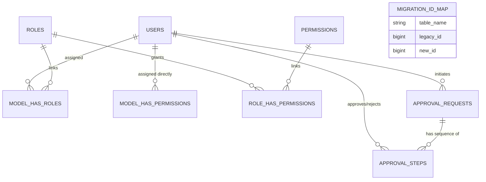

# Public System Database Architecture & Technical Documentation
# الوثيقة الفنية والبنية المعمارية لقاعدة البيانات العامة والنظام الأساسي (Public Schema)

This document provides a comprehensive, professional, and structured technical documentation for the `public` schema in the Digilians TS-V.2 application.
تهدف هذه الوثيقة إلى توفير مرجع فني تقني شامل واحترافي لسكيمة `public` (التأسيسية وإدارة المستخدمين)، مصممة لمهندسي البرمجيات ومديري قواعد البيانات.

---

## 1. Domain: Access Management & Authentication (إدارة الوصول والمستخدمين)

### Table: `users` | جدول: المستخدمين الأساسيين
**Business Purpose / الغرض التجاري:** 
The central authentication and identity table. Every individual accessing the system (Student, Instructor, Agent, Admin) must have exactly one row here.
جدول الهوية والمصادقة المركزي. كل شخص يدخل النظام (طالب، مدرب، موظف دعم، مدير) يمتلك سجلاً واحداً وأساسياً هنا، يتفرع منه بروفايلات أخرى لاحقاً حسب الصلاحيات.

**Relationships / العلاقات:**
- `hasOne`: `trainee_profiles` (في سكيمة التعليم)
- `hasOne`: `instructor_profiles` (في سكيمة التعليم)
- `hasMany`: `tickets`, `ticket_threads` (في سكيمة التذاكر)
- `belongsToMany`: `roles`, `permissions`

**Columns / الحقول:**
| Column Name (الحقل) | Data Type (النوع) | Null | Default | Description (الوصف) |
|---|---|---|---|---|
| `id` | bigint | No | Auto | Unique Identifier / المعرف |
| `name` | varchar | No | - | Full Name / الاسم الكامل |
| `email` | varchar | No | - | Login Email (Unique) / البريد الإلكتروني (وحيد) |
| `password` | varchar | No | - | Bcrypt hashed password / كلمة المرور مشفرة |
| `status` | varchar | No | 'active' | Account state (active, suspended) / حالة الحساب |
| `legacy_id` | bigint | Yes | - | Tracker for migrated accounts / رقم حساب المستخدم في النظام القديم |

---

### Tables: `roles`, `permissions`, `model_has_roles`, `role_has_permissions`
**Business Purpose / الغرض التجاري:**
Spatie Permission architecture. Defines strictly granular access controls based on dynamic Roles.
معمارية (Spatie) للصلاحيات. تحدد من يحق له الدخول لأي موديول (تذاكر، تعليم، أدمن).

- **`roles`**: Contains named groups like "Super Admin", "Supervisor", "Instructor".
- **`permissions`**: Granular nodes like "view tickets", "delete students".
- **`model_has_roles`**: Links a `user_id` to a `role_id` via polymorphic typing (`model_type = 'App\Modules\Users\Domain\Models\User'`).

---

## 2. Domain: Global Identifiers & Tracking (التتبع والمعرفات العامة)

### Table: `migration_id_map` | جدول: خريطة التهجير
**Business Purpose / الغرض التجاري:**
Crucial table used specifically during system upgrades. It maps old sequential IDs from the legacy DB into the new generated IDs.
جدول غاية في الأهمية يُستخدم خصيصاً أثناء عمليات نقل الداتا (Migration). يربط رقم الآي دي في قاعدة البيانات القديمة بالآي دي الجديد الخاص بقاعدة البيانات الحالية.

**Columns / الحقول:**
| Column Name | Data Type | Null | Description |
|---|---|---|---|
| `table_name` | varchar | No | Target table (e.g., 'tickets') / اسم الجدول |
| `legacy_id` | bigint | No | Old Database ID / الرقم في القاعدة القديمة |
| `new_id` | bigint | No | TS-V.2 Database ID / الرقم الجديد هنا |

### Table: `legacy_data_conflicts` | جدول: تعارضات التهجير
**Business Purpose / الغرض التجاري:**
Logs rows that failed to migrate properly (e.g., a ticket assigned to a user who doesn't exist).
يحفظ السجلات التي فشلت في النقل (Data Integrity failure) مثل تذكرة تابعة لطالب غير موجود أو تم حذفه مسبقاً.

---

## 3. Domain: Workflows & Approvals (الاعتمادات والتسلسل الإداري)

### Table: `approval_requests` & `approval_steps`
**Business Purpose / الغرض التجاري:**
Polymorphic workflow engine. If an action requires a Manager's signature, an `approval_request` is generated. `approval_steps` holds the exact sequence (e.g., 1. Supervisor \(\rightarrow\) 2. Dean).
محرك اعتمادات متعدد الأشكال. إذا تطلب أي إجراء بالموقع توقيع مدير، يتم تجميده حتى يوافق المدير عبر هذا الجدول.

- **`status`**: Defines if the whole workflow is `pending`, `approved`, or `rejected`.
- **`action`**: The code of the action (e.g., `delete_group_12`).

---

## 4. Architecture & Data Flow Summary (ملخص المعمارية وتدفق البيانات)

### 📊 Data Flow (تدفق البيانات):
1. **Authentication:** User logs in \(\rightarrow\) `users` validated \(\rightarrow\) `model_has_roles` confirms access capabilities.
2. **Global Integration:** Every operation in `education` (like Instructors) or `tickets` requires a `user_id` binding from this `public.users` table.

### 📈 Mermaid ERD (مخطط العلاقات)

---

## 5. Strategic Analysis: Risks, Scalability & Improvements
## (التحليل الاستراتيجي: المخاطر والتوسع)

### ⚠️ Potential Design Risks (المخاطر التصميمية المحتملة):
1. **Polymorphic Queries (`model_has_roles`)**: Excessive joins with `model_type` as string can be slow. Ensure caching is active on roles/permissions (`Spatie Permission Cache`).
2. **Notification Bloat**: Table `notifications` (Database Notifications) fills up massively if users don't "Mark as Read". Ensure a cron cleans notifications older than 6 months.

### 🚀 Scalability Concerns (مخاوف التوسع):
1. **`users` Table Locking**: Avoid putting highly mutable state directly in the `users` table since it acts as the primary key reference across 2 separate massive schemas (Education & Tickets). Rely entirely on profiles.

### 💡 Suggested Improvements (التحسينات المقترحة):
1. **Spatie Cache Configuration**: Switch permission cache driver from `file` or `database` to `Redis` immediately in production to save massive SQL overhead on every page load.
2. **Audit Trailing in Public Schema**: Currently missing a global `user_activity_log` for login/logout IP addresses, which is typically highly recommended in enterprise educational contexts.
