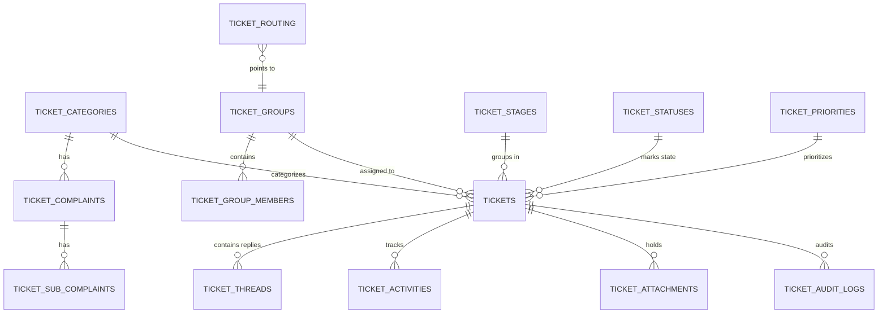

# Ticketing System Database Architecture & Technical Documentation
# الوثيقة الفنية والبنية المعمارية لقاعدة بيانات نظام التذاكر

This document provides a comprehensive, professional, and structured technical documentation for the `tickets` schema in the Digilians TS-V.2 application.
تهدف هذه الوثيقة إلى توفير مرجع فني تقني شامل واحترافي لسكيمة `tickets` (نظام الدعم الفني والتذاكر)، مصمم خصيصاً لمهندسي البرمجيات ومديري قواعد البيانات.

---

## 1. Domain: Ticket Core Operation (العمليات الأساسية للتذاكر)

### Table: `tickets` | جدول: التذاكر
**Business Purpose / الغرض التجاري:** 
The central transactional table storing all support tickets, academic complaints, and inquiries.
يعد الجدول المحوري الذي يحفظ كافة الشكاوى، الطلبات، والتذاكر الخاصة بالدعم الفني والإداري.

**Relationships / العلاقات:**
- `belongsTo`: `users` (المستخدم), `ticket_categories`, `ticket_complaints`, `ticket_stages`, `ticket_statuses`, `ticket_priorities`, `ticket_groups` (مجموعة الدعم).
- `hasMany`: `ticket_threads` (الردود), `ticket_activities` (سجل الحركات), `ticket_audit_logs`, `ticket_attachments`.

**Columns / الحقول:**
| Column Name (الحقل) | Data Type (النوع) | Null | Default | Description (الوصف) |
|---|---|---|---|---|
| `id` | bigint | No | Auto | Unique Identifier / المعرف |
| `uuid` | uuid | No | uuid() | Public external reference / المعرف الخارجي اللغريب للتذكرة |
| `user_id` | bigint | No | - | Who created it / منشئ التذكرة |
| `ticket_number` | varchar | Yes | - | Human-readable number (e.g. TC-2026-001) / رقم مطبوع ومتسلسل |
| `subject` | varchar | No | - | Title summarizing the issue / عنوان ملخص |
| `details` | text | No | - | HTML/text description / تفاصيل الشكوى |
| `locked_by` | bigint | Yes | - | If an agent is viewing/editing / في حال وجود وكيل يعمل عليها الآن لمعا الاحتكاك |
| `due_at` | timestamp | Yes | - | Calculated SLA deadline / موعد الإنجاز الأدنى بحسب الـ SLA |

**Security & Business Constraints / الأمان والقيود:**
- **Record Locking (Pessimistic Locking):** The `locked_by` and `locked_at` columns are used to prevent two agents from replying or modifying the ticket simultaneously.
- **SLA Escalations:** The `due_at` column is strictly controlled by system timers based on `priority` and `category` overrides.

---

### Table: `ticket_threads` | جدول: الردود والمحادثات
**Business Purpose / الغرض التجاري:**
Stores the conversation history attached to a ticket. Can be public messages or invisible internal notes.
يحفظ الحوار الدائر في التذكرة، قد يكون ردوداً تظهر للطالب أو ملاحظات عمل داخلية تظهر للموظفين فقط.

**Columns / الحقول:**
| Column Name | Data Type | Null | Enum | Description |
|---|---|---|---|---|
| `ticket_id` | bigint | No | No | Belongs to / تابعة لأي تذكرة |
| `user_id` | bigint | No | No | Sender / المُرسل |
| `content` | text | No | No | Message Body / نص الرسالة |
| `type` | varchar | No | `message`, `internal_note` | Visibility type / نوع الرد (رسالة عادية أو ملاحظة داخلية) |
| `is_read_by_staff` | boolean | No | No | Read receipt for agents / مقروءة من الدعم |
| `is_read_by_user` | boolean | No | No | Read receipt for creator / مقروءة من المستخدم |

---

## 2. Domain: Classification & Taxonomy (التصنيف والهيكلة)

### Tables: `ticket_categories`, `ticket_complaints`, `ticket_sub_complaints`
**Business Purpose / الغرض التجاري:**
Hierarchical taxonomy to classify the exact nature of the problem.
هيكل شجري وتصنيف لترتيب المشاكل: (فئة > شكوى رئيسية > شكوى فرعية).

- **`ticket_categories`**: Major buckets (e.g., Financial, Academic, Technical).
- **`ticket_complaints`**: Specific issues inside a category (e.g., Missing Grades).
- **`ticket_sub_complaints`**: Extreme specifics (e.g., Mid-term Grade missing).

*Note: Each level holds SLA defaults (`sla_hours`), which cascade down if not overridden.*

---

## 3. Domain: Routing, Groups & Roles (التوجيه وصلاحيات الوصول)

### Table: `ticket_routing` | جدول: التوجيه التلقائي
**Business Purpose / الغرض التجاري:**
Defines dynamic rules so when a ticket is created with a certain Category or Complaint, it is automatically assigned to a specific Support Group.
يحدد قواعد التوجيه، بحيث إذا فتح طالب تذكرة من نوع "مالية"، تذهب فوراً لمجموعة دعم "فريق الحسابات" دون تدخل بشري.

- `entity_type`: Polymorphic (Category or Complaint).
- `entity_id`: The ID of the category or complaint.
- `group_id`: The Ticket Group to assign to.

### Table: `ticket_groups` & `ticket_group_members`
**Business Purpose / الغرض التجاري:**
Groups of support agents (e.g., IT Level 1, Admission Team).
مجموعات العمل (مثل: تيم شئون الطلاب، تيم الدعم التقني).

- `is_leader`: In `ticket_group_members` defines if the agent is the head of this support squad and can override others.

### Role Pivots (`ticket_stage_role`, `ticket_category_role`...)
System employs precise Matrix permissions where specific user Roles (like Supervisor) are allowed access to specific Stages or Categories. 

---

## 4. Domain: Workflow, SLAs & State Machine (دورة العمل والحالة)

### Table: `ticket_stages` | جدول: المراحل
**Business Purpose / الغرض التجاري:**
High-level lifecycle of a ticket (e.g., Triage, Investigation, Resolution, Closed).
دورة الحياة العظمى للتذكرة (فرز، بحث، حل، إغلاق).

- `external_name`: The friendly name to show to students (e.g., internals see "L2 Escalation", student sees "Processing").

### Table: `ticket_statuses` | جدول: الحالات الدقيقة
**Business Purpose / الغرض التجاري:**
Fine-grained status inside a stage (e.g., Pending User Reply, Waiting for 3rd Party).
الحالات الدقيقة جداً المتغيرة.

- `is_final`: A boolean flag determining if this status triggers SLA closure checks.

### Table: `ticket_priorities` | جدول: الأولويات
- `sla_multiplier`: A numeric multiplier. If a Category has 24h SLA, and a ticket is High Priority (Multiplier 0.5), its actual SLA becomes 12h.

---

## 5. Domain: Audit & Actions (التدقيق والنشاط)

### Table: `ticket_activities` & `ticket_audit_logs`
- **`ticket_activities`**: Human-readable history of what happened (e.g., "Ahmed reassigned ticket to Support"). Stored with JSON context.
- **`ticket_audit_logs`**: Crucial DBA-level column-by-column tracking (`old_value` to `new_value`). Immutable for legal accountability.

---

## 6. Architecture & Data Flow Summary (ملخص المعمارية وتدفق البيانات)

### 📊 Data Flow (تدفق البيانات):
1. **Creation**: User creates Ticket \(\rightarrow\) `tickets` logic applies IDs.
2. **Routing**: Observer listens \(\rightarrow\) checks `ticket_routing` \(\rightarrow\) assigns to `ticket_groups`.
3. **SLA Calculation**: Combines Category `sla_hours` \(\times\) Priority `sla_multiplier` \(\rightarrow\) updates `due_at`.
4. **Communication**: Agents respond adding `ticket_threads` (Message). If internal discussion is needed, they use (Internal Note).
5. **Closure**: Status shifted to `is_final`=True \(\rightarrow\) SLA timer stops, ticket locks down.

### 📈 Mermaid ERD (مخطط العلاقات)

---

## 7. Strategic Analysis: Risks, Scalability & Improvements
## (التحليل الاستراتيجي: المخاطر والتوسع)

### ⚠️ Potential Design Risks (المخاطر التصميمية المحتملة):
1. **Attachment Bloat**: Directly linking `ticket_attachments` might require frequent physical storage checks. Ensure a cron job purges unlinked attachment temporaries.
2. **Pessimistic Locking**: `locked_by` is prone to ghost-locks if an agent's browser crashes. An automated cron must release locks older than exactly 10 minutes (`auto_close_at` style cleanup).

### 🚀 Scalability Concerns (مخاوف التوسع):
1. **`ticket_audit_logs` Size**: In a system generating thousands of tickets, the audit log will grow exponentially (every status change triggers a row). 
   - **Solution**: Data Archiving. Move audit logs > 2 years out of PostgreSQL to Cold Storage (S3 / BigQuery).
2. **UUID Search Performance**: Searching by UUID involves string parsing in default config. 
   - **Solution**: Ensure UUID column has a specific `uuid_ops` binary index if Postgres isn't already optimizing it natively.

### 💡 Suggested Improvements (التحسينات المقترحة):
1. **SLO vs SLA Table**: Decouple static SLA hours to support a dynamic Rules Engine (e.g., "During Ramadan, multiply SLA by 1.5").
2. **Sentiment Analysis Hook**: The `ticket_threads` table holds vast textual data; applying an async LLM tag payload on the `content` could auto-route angry users to managers.
